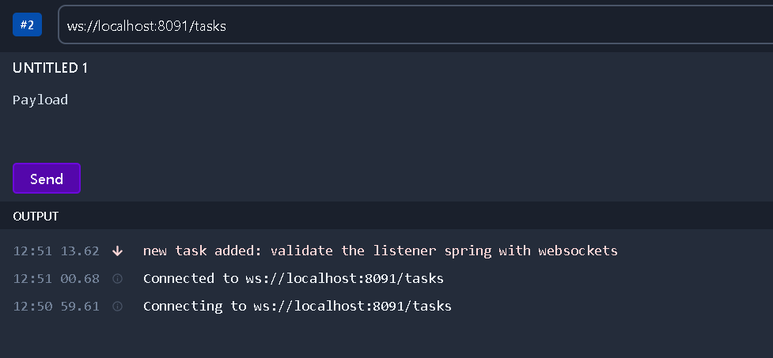

# Getting Started

## project using jenkins

#### example request of HTTP POST

### project springboot application
# Technologies
1. Java
2. Spring
3. Lombok
4. PostgresSQL
5. guava
6. rxJava
7. WebSockets

## personal project
### also i use jenkins for automate the commits merge

# Important
## you need subscribe/listen the url websockets see the example

